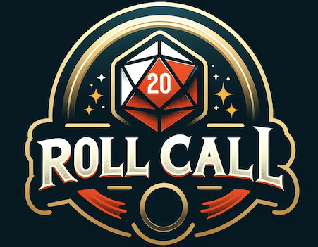

RollCall is a community-focused web application designed to bring gamers together by facilitating the organization and discovery of gaming events. Users can create, browse, and join events for board games, role-playing games, and card games. The platform also allows users to form and manage groups, fostering a sense of community among gamers.

Check it out live! https://rollcall.site/

## Features

- **Group Management**: Users can create, search, edit, and delete groups. Each group can host multiple events, creating a mini-community within the platform.

    

- **Event Management**: Users can create, edit, and delete events within groups. Events can be viewed in a detailed list with information such as the event name, start and end times, and associated group.

     

- **User Authentication**: Secure login and registration system to manage user access.

     

- **Profile Management**: Users can manage their profiles, including credentials and participation in events and groups.

     

- **Game Addition by Users with Integration with BoardGameGeek API**: Users can suggest new games to be added to the platform's catalog, pending approval by administrators. This feature encourages community involvement in growing the game database. Games can be entered manually or via boardgamegeek website which integrates with the bgg api to pull game details!

    

- **Game Catalog**: Introduce a comprehensive list of board games, role-playing games, and card games. Each event will be able to associate itself with a game from this catalog, enhancing event details and user experience.

    

## Planned Features

- **User Join**: Implement ability for users to join events.
- **User Comments**: Enable users to leave comments on event and group pages, fostering interaction and feedback within the community.
- **Geographical Tags**: Allow events to be tagged with geographical information. Users can search for events based on their location or browser location, making it easier to find local gaming communities.
- **Top Games Dropdowns**: Implement a dropdown feature in the event creation form to suggest the top 10 popular games for easier selection.

## Technical Details

- **Backend**: The application is built on the Spring Boot framework, utilizing Spring Security for authentication and authorization.
- **Database**: Uses JPA repositories with Hibernate for ORM, supporting a relational database management system (RDBMS) such as MySQL or PostgreSQL. In my implementation I'm using PostGres.
- **Frontend**: Thymeleaf templates for rendering server-side HTML, integrated with Bootstrap for responsive design.
